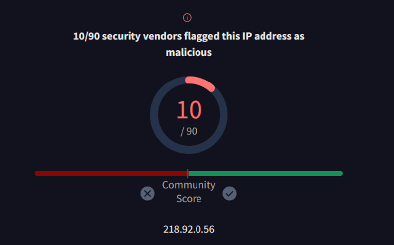
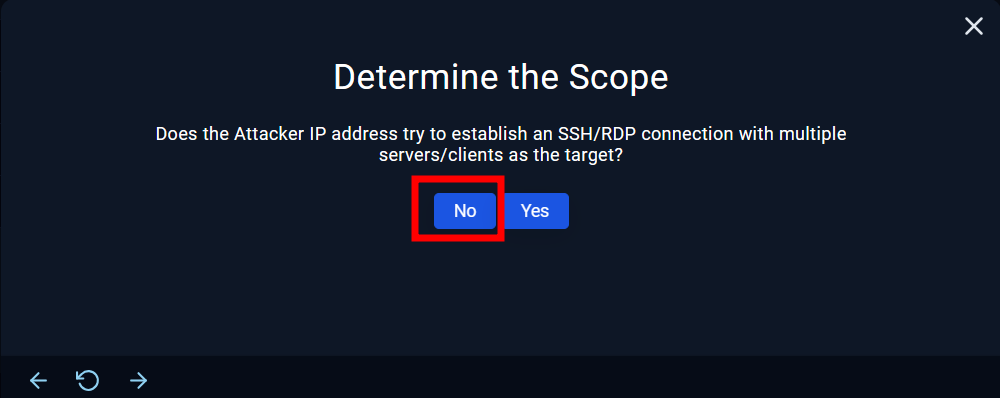
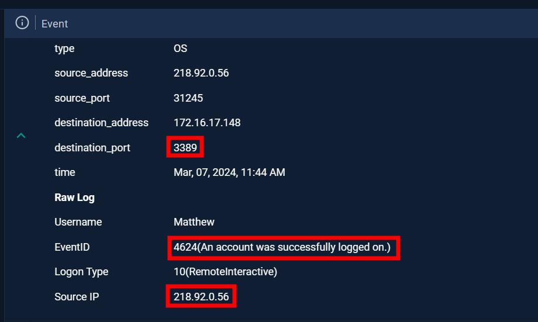
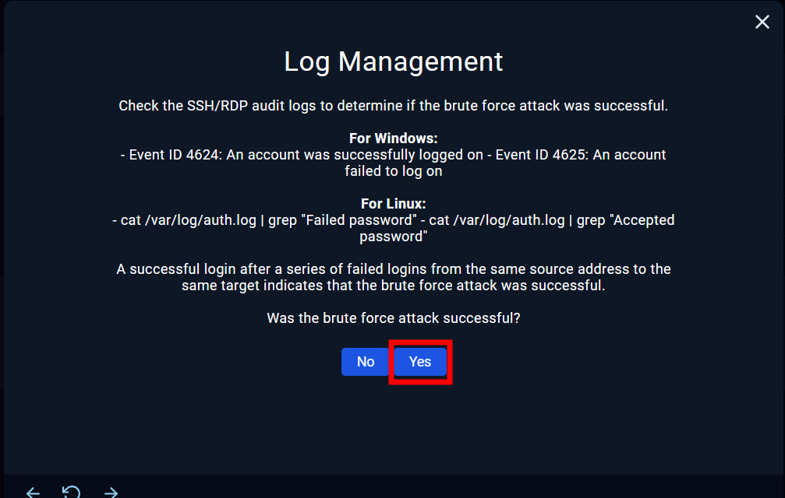
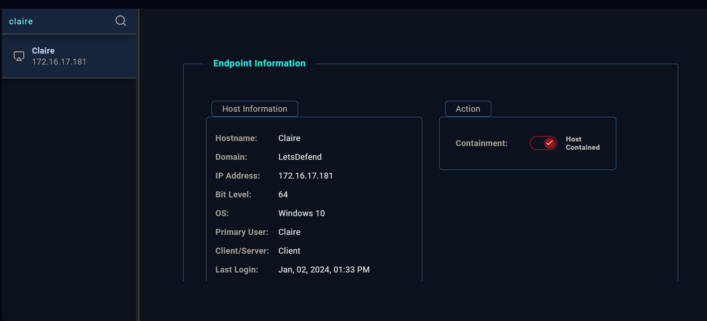

# INFORME DE INCIDENTES (PLAYBOOKS LETSDEFEND.IO)

| INFORMACIÓN | SOC176 - RDP Brute Force Detected                                                                                                                                                                                                                                                                                                                                      |
| ---------------------------- | -------------------------------------------------------------------------------------------------------------------------------------------------------------------------------------------------------------------------------------------------------------------------------------------------------------------------------------------------------------------------------------------- |
| Clasificación según taxonomía | Categoría de Phishing (QR)                                                                                                                                                                                                                                                                                                                                                                                            |
| Criticidad                   | Media                                                                                                                                                                                                                                                                                                                                                                                             |
| Descripción del incidente    | Este es un ataque de fuerza bruta a través del Protocolo de Escritorio Remoto (RDP). En este tipo de ataque, se realizan intentos repetidos de inicio de sesión utilizando diferentes combinaciones de nombres de usuario y contraseñas en un sistema que utiliza el Protocolo de Escritorio Remoto para conexiones remotas.                                                                                                                                                                                                                                                                                                                                                                                             |
| Acciones tomadas para su resolución | Se sabe que la IP obtenida por el servicio RDP es externa, gracias al análisis realizado en Virustotal que nos lo termina de aclarar con el siguiente resultado:   Gracias a esto, se sabe que la IP obtenida es sospechosa. Ahora es importante conocer si el atacante ha utilizado diferentes clientes (IP) par aconectarse al equipo dentro de los logs:  Como se puede apreciar, la IP es la misma en todos los ataques al HOST de Matthew por lo cual no hay más clientes utilizados, mo tampoco intentos de inicio por SSH/RDP con multiusuario.  Ahora revisaremos en los logs si de verdad pudo acceder al dispositivo o no, sabiendo que la ID de evento de autenticación exitosa es el 4624, para así poder utilizar el buscador directamente:  Podemos ver que en efecto el atacante se autenticó en el dispositivo y pudo realizar acciones.  ¿Deberíamos aislar al dispositivo de Matthew para no recorrese la red en busca de más dispositivos? Está más que clara la respuesta, y es que si no lo hiciésemos este podría realizar estragos en la red solo con la posesión de privilegios de un dispositivo.  
                                                                                                                                                                                                                                                                                                                                                                                     |
                                                                                                                                                                                                                                                                                                                                      
                                                                                                                                                                                                                                                                                                                                      
                                                                                                                                                                                                                                                                                                                                      
| INFORMACIÓN | SOC251 - Quishing Detected (QR Code Phishing)                                                                                                                                                                                                                                                                                                                                      |
| ---------------------------- | -------------------------------------------------------------------------------------------------------------------------------------------------------------------------------------------------------------------------------------------------------------------------------------------------------------------------------------------------------------------------------------------- |
| Clasificación según taxonomía | Detección y prevención de intrusiones                                                                                                                                                                                                                                                                                                                                                                                            |
| Criticidad                   | Media                                                                                                                                                                                                                                                                                                                                                                                             |
| Descripción del incidente    | Se define como un ataque de phishing que utiliza códigos QR como vector de ataque. En este caso, el atacante crea un código QR malicioso y lo distribuye a través de un correo electrónico o un sitio web. Cuando la víctima escanea el código QR con su dispositivo móvil, se redirige a un sitio web falso o malicioso que intenta robar sus credenciales o instalar malware.                                                                                                                                                                                                                                                                                                                                                                                             |
| Acciones tomadas para su resolución | Primero de todo, nos aseguramos de que la IP que hemos obtenido es maliciosa yendo a VirusTotal.  Una vez analizado la IP 208.94.90.1, es momento de leer el correo en el cual se ha producido el QR Phishing, para ello sabemos que el correo es security@microsecmfa.com y que la afectada es Claire, así que el único correo correspondiente es de un "Microsoft falso" el cual contiene un QR que vamos a analizar en CyberChef.   Como se puede apreciar, este QR tiene una IP sospechosa, la cual vamos a analizar con VirusTotal:  Esta más que claro que nos encontramos con un phishing incluso reconocido por la misma base de datos de VirusTotal. Así que como acción necesaria, vamos a eliminar el correo y poner al dispositivo de Claire en cuarentena.   Ya hemos solucionado el problema, ahora reunamos los artifacts:  
                                                                                                                                                                                                                                                                                                                                                                                     |

| INFORMACIÓN | SOC250 - APT35 HyperScrape Data Exfiltration Tool Detected                                                                                                                                                                                                                                                                                                                                      |
| ---------------------------- | -------------------------------------------------------------------------------------------------------------------------------------------------------------------------------------------------------------------------------------------------------------------------------------------------------------------------------------------------------------------------------------------- |
| Clasificación según taxonomía | Categoría de Phishing                                                                                                                                                                                                                                                                                                                                                                                            |
| Criticidad                   | Media                                                                                                                                                                                                                                                                                                                                                                                             |
| Descripción del incidente    | El incidente involucra el uso de la herramienta HyperScrape para la exfiltración de datos. Esta herramienta se utiliza para robar información del usuario, como credenciales y datos personales.                                                                                                                                                                                                                                                                                                                                                                                             |
| Acciones tomadas para su resolución | Vamos a ver la página Administración de registros para ver si hay un registro para la alerta:  Y podemos ver que hay registros relacionados con la dirección IP de nuestro host.  Ahora deberíamos ver las páginas de Endpoint & Email Security y asegurarnos de que el programa da información útil:   Aquí debemos seleccionar Recopilar información de identidad de la víctima porque la herramienta HYPERSCRAPE se utiliza para robar datos del usuario.  Busqué las direcciones IP en la página de virustotal y de información sobre amenazas y resultó ser externa y maliciosa:   También busqué hash de archivos en virustotal y:  Y cuando miré la página de Endpoint Security vi que solo el host Arthur se vio afectado.  Y como el ataque fue exitoso, aislamos el dispositivo:

                                                                                                                                                                                                                                                                                                                                                                                     |
                                                                                                                                                                                                                                                                                                                                                                                     
                                                                                                                                                                                                                                                                                                                                                                                     
                                                                                                                                                                                                                                                                                                                           
| INFORMACIÓN | SOC170 - Passwd Found in Requested URL - Possible LFI Attack                                                                                                                                                                                                                                                                                                                                      |
| ---------------------------- | -------------------------------------------------------------------------------------------------------------------------------------------------------------------------------------------------------------------------------------------------------------------------------------------------------------------------------------------------------------------------------------------- |
| Clasificación según taxonomía | Ataques de seguridad en aplicaciones web                                                                                                                                                                                                                                                                                                                                                                                            |
| Criticidad                   | Alta                                                                                                                                                                                                                                                                                                                                                                                             |
| Descripción del incidente    | El atacante utiliza una carga útil LFI en la URL, como '../../../../etc/passwd', para intentar eludir el directorio raíz del sitio web y acceder al archivo de contraseñas del sistema.                                                                                                                                                                                                                                                                                                                                                                                             |
| Acciones tomadas para su resolución | Primero, inspeccionaré el punto final WebServer1006 desde **Log Management** para analizar la comunicación entre el servidor web y la dirección IP 106.55.45.162 del actor de amenazas.  Como se muestra en el panel de administración de registros, la dirección IP sospechosa intentó acceder a una URL e intentó llegar al directorio raíz para obtener acceso al archivo "passwd", que almacena todas las contraseñas en el servidor. Hasta ahora hemos confirmado dos cosas importantes. En primer lugar, hay un "Verdadero Positivo", que indica un ataque. En segundo lugar, este ataque no tuvo éxito ya que el servidor arrojó un código de estado 500 sin respuesta. Ahora llevemos a cabo una investigación exhaustiva de la dirección IP del atacante y esto es lo que encontré en VirusTotal:  Entonces, la dirección IP del actor de la amenaza proviene de China. Si profundizas más en el apartado de detalles podrás obtener más información sobre el propietario de la dirección IP. Además, puede realizar una verificación cruzada de esta información utilizando otra plataforma de inteligencia contra amenazas. En mi caso, utilicé Cisco Talos para realizar más investigaciones **.** Como nota final: Es una alerta de Verdadero Positivo, el intento no tuvo éxito, no es necesario contener al webserver1006 ya que el ataque no tuvo éxito, no es necesario escalar al equipo SOC de nivel 2 y por último el ataque se originó desde Internet a la red local. 

                                                                                                                                                                                                                                                                                                                                                                                     |

| INFORMACIÓN | SOC239 - Remote Code Execution Detected in Splunk EnterpriseAttack                                                                                                                                                                                                                                                                                                                                    |
| ---------------------------- | -------------------------------------------------------------------------------------------------------------------------------------------------------------------------------------------------------------------------------------------------------------------------------------------------------------------------------------------------------------------------------------------- |
| Clasificación según taxonomía | Ataques de seguridad en aplicaciones web                                                                                                                                                                                                                                                                                                                                                                                            |
| Criticidad                   | Alta                                                                                                                                                                                                                                                                                                                                                                                             |
| Descripción del incidente    | La detección de "Remote Code Execution" indica que se ha identificado un intento o una actividad de ejecución de código remoto, lo que sugiere que un atacante podría haber logrado ejecutar código arbitrario en un sistema o aplicación de Splunk Enterprise desde una ubicación remota.                                                                                                                                                                                                                                                                                                                                                                                             |
| Acciones tomadas para su resolución | Detectamos entre qué dos dispositivos se produce el tráfico. Recopilaremos estos artefactos más tarde. Ahora investiguemos estos artifacts. Primero, busquemos la dirección 180.101.88.240 en Virustotal y AbuseIPDB . Y descubrí que esta dirección IP es maliciosa.   Y aquí vemos que la dirección IP pertenece a la empresa China Telecom. Y también revisé Gestión de registros y encontré los siguientes registros:  Y según los resultados que obtuvimos de los registros de Virustotal y AbuseIPDB, podemos decir que el tráfico es malicioso . Tenemos el archivo shell.zip que lo investigamos. Lo descomprimí y me dio dos archivos como los siguientes: archivo script(.sh) y . archivo xsl :  Luego abrí el archivo shell.xsl y vi el siguiente código:  Si no sabemos cuál es este código, podemos preguntarle a ChatGPT y nos brindará la siguiente explicación: Este código parece ser un intento de ataque de inyección de entidad externa XML (XXE) en lugar de una transformación XSLT legítima. Con base en lo anterior, podemos determinar que este archivo realiza un ataque de inyección XML. No parece haber nada conectado, por lo tanto, esto no estaba planeado.  Vimos que la acción del dispositivo está permitida , por lo tanto, el ataque fue exitoso. Como se muestra arriba, el dispositivo debe estar aislado para restringir al atacante y por lo tanto contenemos el dispositivo relevante:  Al final, registramos los artefactos que encontramos en los campos correspondientes y completamos el libro de jugadas: 
                                                                                                                                                                                                                                                                                                                                                                                     |

| INFORMACIÓN | SOC210 - Possible Brute Force Detected on VPN                                                                                                                                                                                                                                                                                                                                     |
| ---------------------------- | -------------------------------------------------------------------------------------------------------------------------------------------------------------------------------------------------------------------------------------------------------------------------------------------------------------------------------------------------------------------------------------------- |
| Clasificación según taxonomía | Detección y prevención de intrusiones en redes                                                                                                                                                                                                                                                                                                                                                                                            |
| Criticidad                   | Alta                                                                                                                                                                                                                                                                                                                                                                                             |
| Descripción del incidente    | La etiqueta indica que ha habido una detección o una sospecha de que se están realizando intentos de fuerza bruta en un punto de acceso VPN.                                                                                                                                                                                                                                                                                                                                                                                             |
| Acciones tomadas para su resolución | Verificaremos la dirección IP de origen en la administración de registros. Se generaron muchos registros en el momento en que se activó la alerta. Los analizaremos todos uno por uno para verificar la nota dejada por L1.   Los dos registros anteriores se generaron uno tras otro e incluso antes de estos dos, hubo muchos intentos de inicio de sesión para conectarse a la VPN que involucraban nombres de usuario incorrectos. Entonces, esto definitivamente indica un ataque de fuerza bruta, ya que hubo un intento de inicio de sesión exitoso después de varios intentos fallidos. Ahora buscaremos al usuario Mane en el EPS para ver si hubo procesos sospechosos, actividades de red o historial de comandos.  Según la observación, ninguna de las actividades del sistema ocurrió después de que se generó la alerta, es decir, después de que el inicio de sesión fue exitoso. Aquí podemos ver que la dirección IP del sistema es diferente a la dirección IP de destino mencionada en los registros (33.33.33.33), ya que el atacante ha forzado la VPN a ingresar a la red de la empresa y todos sabemos eso.  Buscamos la dirección IP en VirusTotal, y está marcada como maliciosa y también clasificada en la categoría de fuerza bruta.Si buscamos la dirección IP de origen en EPS, no encontramos ningún dispositivo asociado a ella, por lo que es: Externa .  Sí, recibió solicitudes de la dirección IP del atacante.  Según nuestro análisis inicial de la gestión de registros, podemos decir que el ataque fue exitoso. Entonces sí .   Como el intento de inicio de sesión fue exitoso, necesitamos contener el dispositivo, por lo que la respuesta es: Sí .
                                                                                                                                                                                                                                                                                                                                                                                     |
