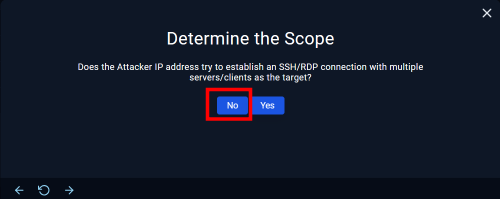

| INFORMACIÓN | SOC176 - RDP Brute Force Detected                                                                                                                                                                                                                                                                                                                                      |
| ---------------------------- | -------------------------------------------------------------------------------------------------------------------------------------------------------------------------------------------------------------------------------------------------------------------------------------------------------------------------------------------------------------------------------------------- |
| Clasificación según taxonomía | Detección y prevención de intrusiones                                                                                                                                                                                                                                                                                                                                                                                            |
| Criticidad                   | Media                                                                                                                                                                                                                                                                                                                                                                                             |
| Descripción del incidente    | Este es un ataque de fuerza bruta a través del Protocolo de Escritorio Remoto (RDP). En este tipo de ataque, se realizan intentos repetidos de inicio de sesión utilizando diferentes combinaciones de nombres de usuario y contraseñas en un sistema que utiliza el Protocolo de Escritorio Remoto para conexiones remotas.                                                                                                                                                                                                                                                                                                                                                                                             |
| Acciones tomadas para su resolución | Se sabe que la IP obtenida por el servicio RDP es externa, gracias al análisis realizado en Virustotal que nos lo termina de aclarar con el siguiente resultado:  ![img/10.png] 

Gracias a esto, se sabe que la IP obtenida es sospechosa. Ahora es importante conocer si el atacante ha utilizado diferentes clientes (IP) par aconectarse al equipo dentro de los logs:  

Como se puede apreciar, la IP es la misma en todos los ataques al HOST de Matthew por lo cual no hay más clientes utilizados, mo tampoco intentos de inicio por SSH/RDP con multiusuario. 

Ahora revisaremos en los logs si de verdad pudo acceder al dispositivo o no, sabiendo que la ID de evento de autenticación exitosa es el 4624, para así poder utilizar el buscador directamente: 
Podemos ver que en efecto el atacante se autenticó en el dispositivo y pudo realizar acciones. 

¿Deberíamos aislar al dispositivo de Matthew para no recorrese la red en busca de más dispositivos? Está más que clara la respuesta, y es que si no lo hiciésemos este podría realizar estragos en la red solo con la posesión de privilegios de un dispositivo.  
                                                                                                                                                                                                                                                                                                                                                                                     |
                                                                                                                                                                                                                                                                                                                                      
                                                                                                                                                                                                                                                                                                                                      
                                                                                                                                                                                                                                                                                                                                      
| INFORMACIÓN | SOC176 - RDP Brute Force Detected                                                                                                                                                                                                                                                                                                                                      |
| ---------------------------- | -------------------------------------------------------------------------------------------------------------------------------------------------------------------------------------------------------------------------------------------------------------------------------------------------------------------------------------------------------------------------------------------- |
| Clasificación según taxonomía | Detección y prevención de intrusiones                                                                                                                                                                                                                                                                                                                                                                                            |
| Criticidad                   | Media                                                                                                                                                                                                                                                                                                                                                                                             |
| Descripción del incidente    | Este es un ataque de fuerza bruta a través del Protocolo de Escritorio Remoto (RDP). En este tipo de ataque, se realizan intentos repetidos de inicio de sesión utilizando diferentes combinaciones de nombres de usuario y contraseñas en un sistema que utiliza el Protocolo de Escritorio Remoto para conexiones remotas.                                                                                                                                                                                                                                                                                                                                                                                             |
| Acciones tomadas para su resolución | 
                                                                                                                                                                                                                                                                                                                                                                                     |
